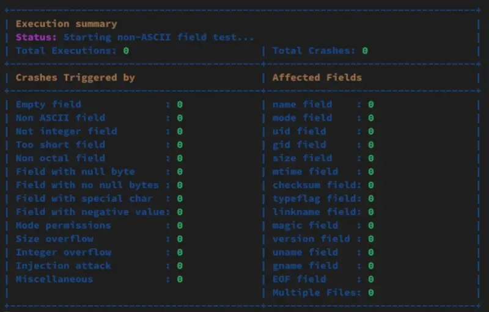

Generation fuzzer for tar archive for the UCL Computer Security Course



## How to use`

### Debian/Kali (wsl)

```bash
sudo apt update
sudo apt install -y gcc make
cd <path_to_project>
make
```

Then execute the tar_fuzzer with the following command:

```
./fuzzer <path_to_tar_extractor>
```

### Documentation

Function are commented in their respective `.h` file